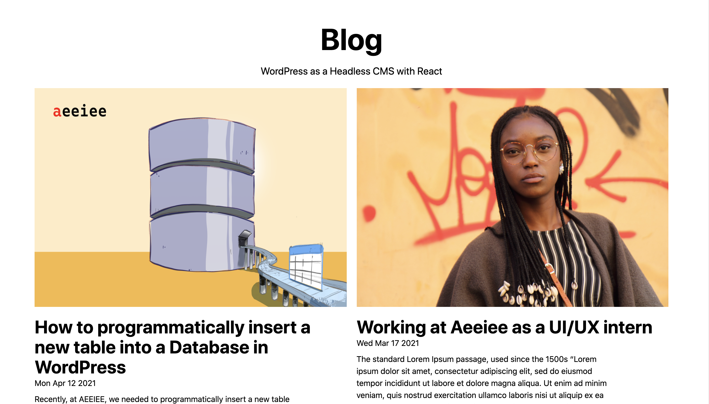

# WordPress Headless CMS + NextJS 

This repo contains the FrontEnd of an application that uses WordPress as a Headless CMS. 

## Built With

- React (Next.js)
- WordPress

## Demo



## Getting Started

**To get started, follow the instructions below**

To get a local copy up and running follow these simple example steps.

- Setup and run a WordPress server by following the blog post [here]()
- Switch out the constants in the `lib/constants.js` file with the correct URLs to your WordPress Server.

For the frontend:

- run

```
yarn install
```

to install all packages. then

```
yarn dev
```

- to start the app in the browser.

### Prerequisites

- Node^8.0


## Authors

👤 **Adebola**

- Github: [@githubhandle](https://github.com/onedebos)
- Twitter: [@twitterhandle](https://twitter.com/debosthefirst)
- Linkedin: [linkedin](https://www.linkedin.com/in/adebola-niran/)


## Acknowledgments

Images by 
- 

## 📝 License

This project is [MIT](lic.url) licensed.
